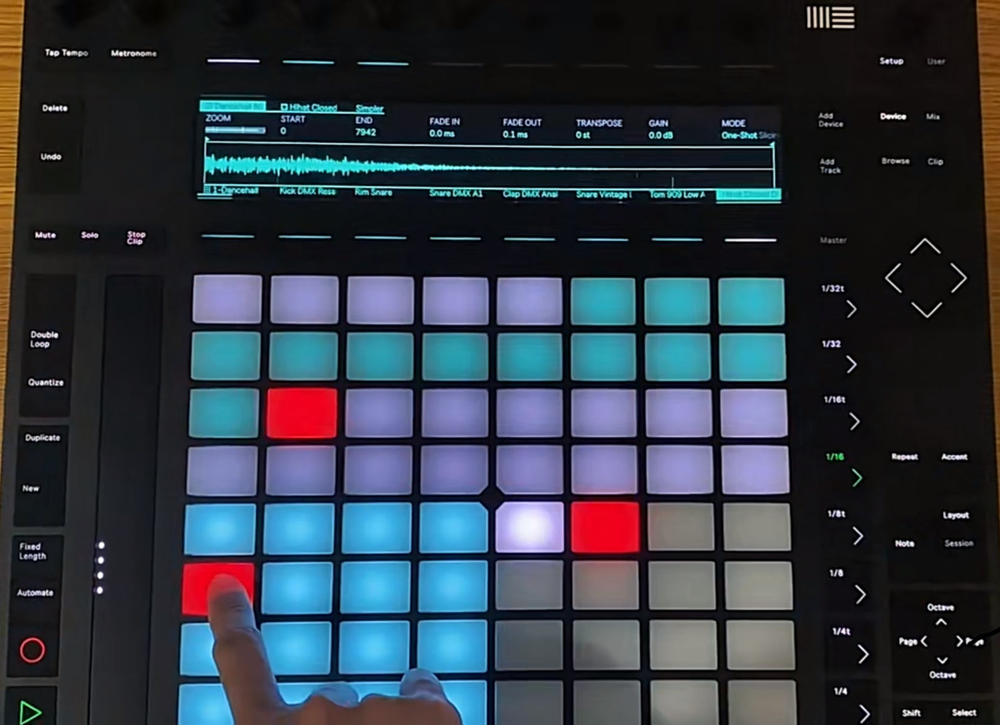

# Interactive description
Based on the group work, add audio to interact the randomly moving squares with the frequency of the audio, clicking on the button located in the middle of the window frame, then the squares will move according to the audio. Clicking on the T button moves the squares less frequently and clicking on the S button moves the squares more frequently.

# Details of your individual approach
I chose audio to drive my personal code. 

1.Building on the group work, we have a portion of the square randomly changing position to create a motion effect each time the window is pulled, and also updating the motion effect each time the page is refreshed. Continuing on from my individual work was the randomly moving part of the square which was put into the function to change with the music. 

2.As the music chosen was on the rockier side, my group assignment changed the saturation brightness of the colours throughout to make it more rocky in style.

3.Oval shapes were also added to make the finished product of my assignment blend better with the inspiration.

# Inspiration
My personal inspiration image is the disc jockey. Since the part I chose was audio, it was natural to think of making a large disc jockey for music that grooves with the music and can be controlled as the group code took shape.

# Technical explanation
1.Based on the group code, I inserted the audio file and used fft to convert the added audio signal to universal frequency data, in addition to using frequency data segments and smoothing to control the data. After analysing the audio it was interacted with the existing graphics. Additionally a control button was added to control the start and pause of the audio.

2.I used the technique of code from the network to get the energy values of low, mid and high frequencies. This code comes from chatgpt and is the code used to control which part of the rectangle each border is changing according to which part of the value is changing, in order to make the animation effect random and with regularity, which allows for a better control of the rhythm.I used the technique of code from the network to get the energy values of low, mid and high frequencies. This code comes from chatgpt and is the code used to control which part of the rectangle each border is changing according to which part of the value is changing, in order to make the animation effect random and with regularity, which allows for a better control of the rhythm.