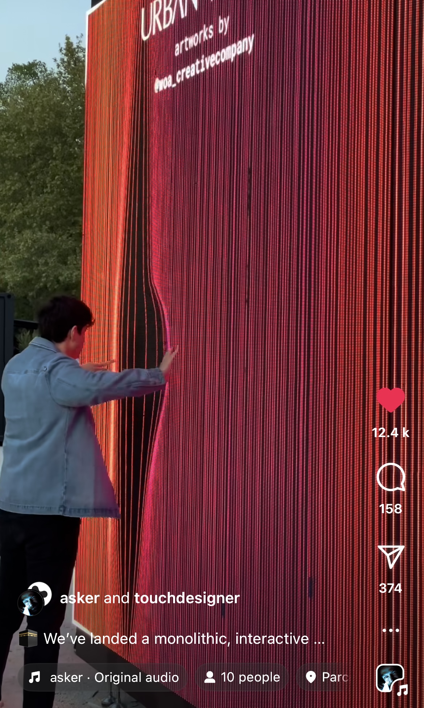
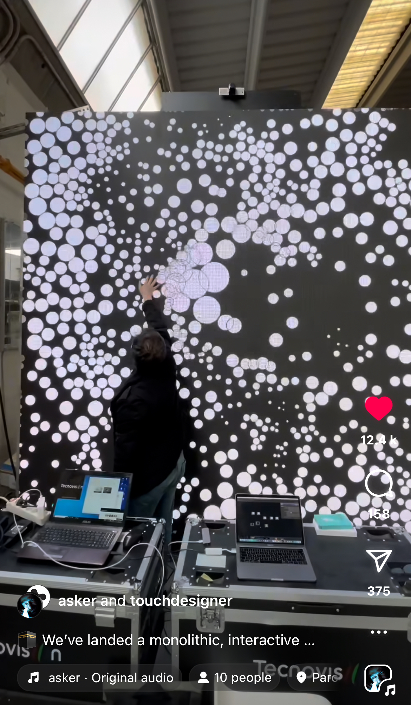
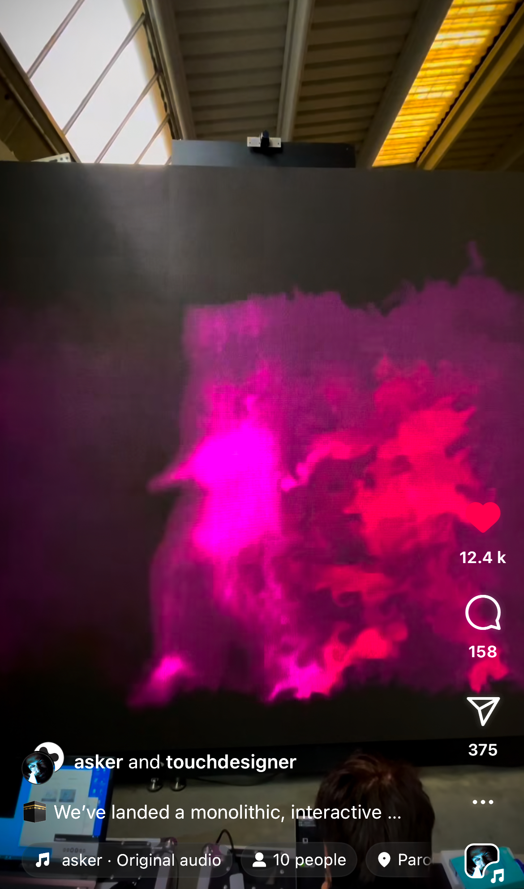

# rzen0962_9103_tut7

## Imaging Technique Inspiration

I chose a street art piece co-created by touchdesiger and asker. The authors build interaction cubes with a lot of interactive animations on them, such as:
1. Plucking the curtains on the screen with your hand

2. Touching the screen full of small orbs with your hand and they will spread out

3. A person walking in front of the screen will have a human shadow. 

I would like to incorporate the part of **touching to change the screen**  into the project, replacing the mouse with the hand for human-computer interaction.

## Coding Technique Exploration

This code can help to achieve the third interaction effect. 
1. First of all, listen to the mouse movement event, and then store the mouse track through an array
2. then use the for loop to draw different sizes and positions of the circle in each frame
3. set the size of the circle with different sizes over time, to form the effect of moving gradient.
This can creates an interactive canvas.

[Link Web](https://processing.org/examples/storinginput.html)

